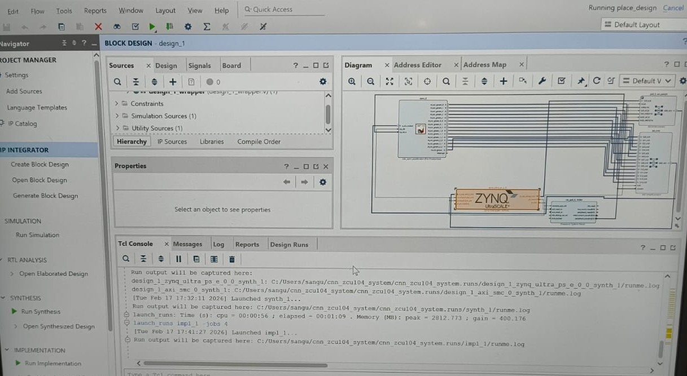
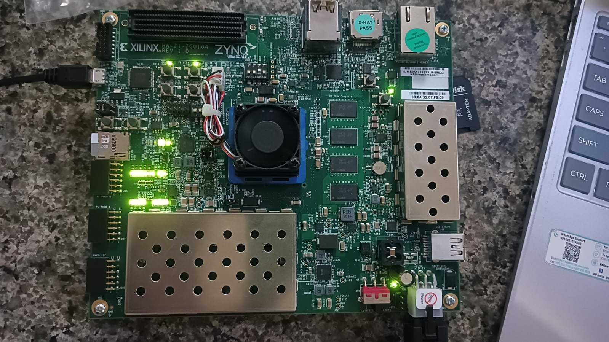
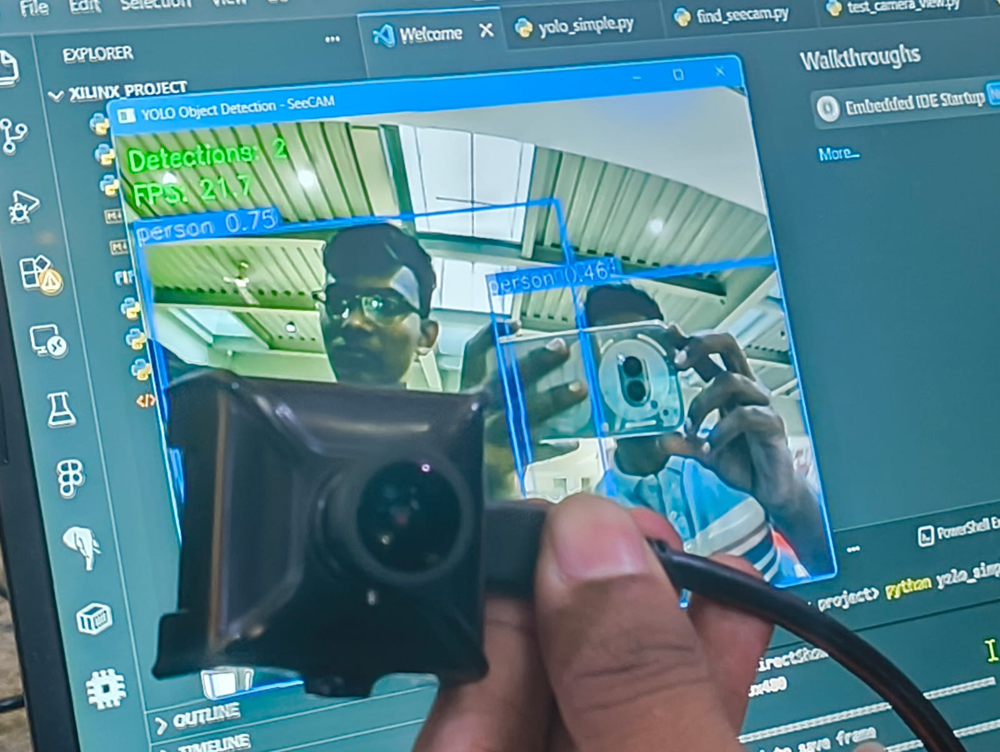
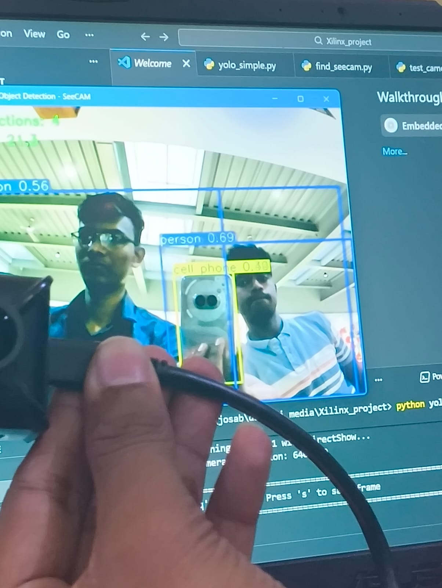
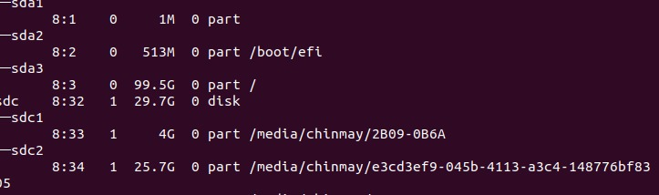
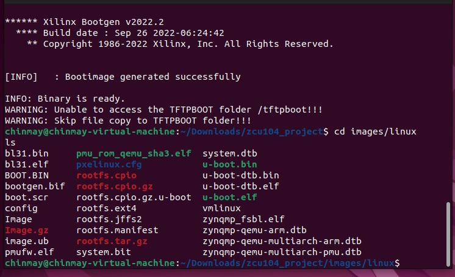
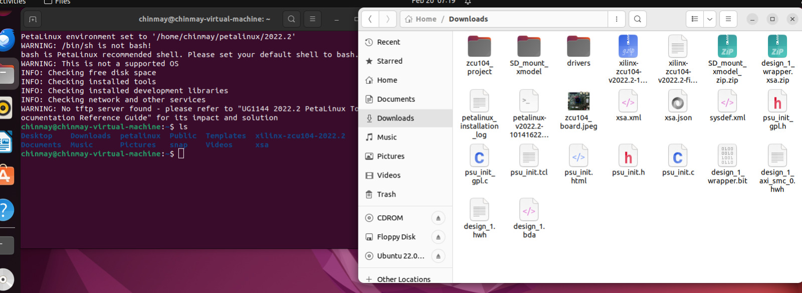

# Real-Time Object Detection Using Hardware-Accelerated CNN on Zynq FPGA

This project implements a real-time object detection system using hardware-accelerated CNN on Xilinx Zynq FPGA with ARM processor.

---

## Block Diagram

---

## FPGA Board

---

## Hardware Setup

---

## Output Results

